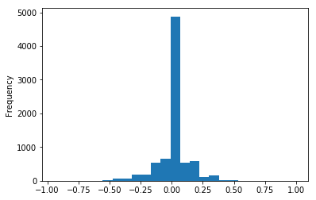
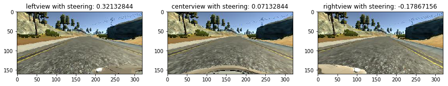
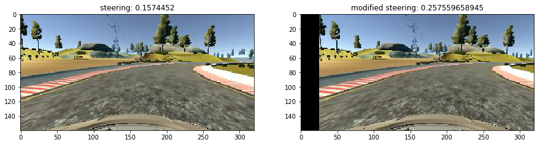
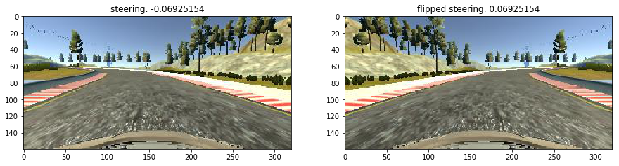
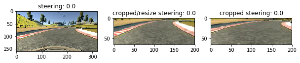
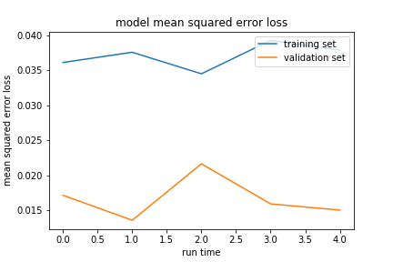

# **Behavioral Cloning** 

---

**Behavioral Cloning Project**

The goals / steps of this project are the following:

* Use the simulator to collect data of good driving behavior
* Build, a convolution neural network in Keras that predicts steering angles from images
* Train and validate the model with a training and validation set
* Test that the model successfully drives around track one without leaving the road
* Summarize the results with a written report


### Files Submitted

My project includes the following files:

* model.py containing the script to create and train the model
* drive.py for driving the car in autonomous mode
* video.py for recording vedios
* model.h5 containing a trained convolution neural network 
* report.md summarizing the results
* video.mp4 the trained model applied on simulator
* weights a collection of possible h5 files

Using the Udacity provided simulator and my drive.py file, the car can be driven autonomously around the track by executing 

```sh
python drive.py model.h5
```

### 1. Model Description

#### 1. Introduction

I only used the data set provided from Udacity to train the model and tested on the first track only, and used convlution network model with dropout as my model. Here below is the model descriptions.

#### 2. Model

In my model step, I utilized the model provided in the paper [Nvidian](https://images.nvidia.com/content/tegra/automotive/images/2016/solutions/pdf/end-to-end-dl-using-px.pdf) and added dropout layers(model.py line 147) becaus this model is quite popular for deep learning approach for self-driving. The text description of the model is below, and a more detail visulaization of the layer is [here](model.png)

```
____________________________________________________________________________________________________
Layer (type)                     Output Shape          Param #     Connected to                     
====================================================================================================
lambda_1 (Lambda)                (None, 66, 200, 3)    0           lambda_input_1[0][0]             
____________________________________________________________________________________________________
convolution2d_1 (Convolution2D)  (None, 31, 98, 24)    1824        lambda_1[0][0]                   
____________________________________________________________________________________________________
spatialdropout2d_1 (SpatialDropo (None, 31, 98, 24)    0           convolution2d_1[0][0]            
____________________________________________________________________________________________________
convolution2d_2 (Convolution2D)  (None, 14, 47, 36)    21636       spatialdropout2d_1[0][0]         
____________________________________________________________________________________________________
spatialdropout2d_2 (SpatialDropo (None, 14, 47, 36)    0           convolution2d_2[0][0]            
____________________________________________________________________________________________________
convolution2d_3 (Convolution2D)  (None, 5, 22, 48)     43248       spatialdropout2d_2[0][0]         
____________________________________________________________________________________________________
spatialdropout2d_3 (SpatialDropo (None, 5, 22, 48)     0           convolution2d_3[0][0]            
____________________________________________________________________________________________________
convolution2d_4 (Convolution2D)  (None, 3, 20, 64)     27712       spatialdropout2d_3[0][0]         
____________________________________________________________________________________________________
spatialdropout2d_4 (SpatialDropo (None, 3, 20, 64)     0           convolution2d_4[0][0]            
____________________________________________________________________________________________________
convolution2d_5 (Convolution2D)  (None, 1, 18, 64)     36928       spatialdropout2d_4[0][0]         
____________________________________________________________________________________________________
spatialdropout2d_5 (SpatialDropo (None, 1, 18, 64)     0           convolution2d_5[0][0]            
____________________________________________________________________________________________________
flatten_1 (Flatten)              (None, 1152)          0           spatialdropout2d_5[0][0]         
____________________________________________________________________________________________________
dropout_1 (Dropout)              (None, 1152)          0           flatten_1[0][0]                  
____________________________________________________________________________________________________
dense_1 (Dense)                  (None, 100)           115300      dropout_1[0][0]                  
____________________________________________________________________________________________________
dense_2 (Dense)                  (None, 50)            5050        dense_1[0][0]                    
____________________________________________________________________________________________________
dense_3 (Dense)                  (None, 10)            510         dense_2[0][0]                    
____________________________________________________________________________________________________
dropout_2 (Dropout)              (None, 10)            0           dense_3[0][0]                    
____________________________________________________________________________________________________
dense_4 (Dense)                  (None, 1)             11          dropout_2[0][0]                  
====================================================================================================
Total params: 252,219
Trainable params: 252,219
Non-trainable params: 0
____________________________________________________________________________________________________

```


The model was trained and validated on the data sets provided by Udacity. The model was tested by running it through the simulator and ensuring that the vehicle could stay on the track. The model used an adam optimizer,  (model.py line 168).

#### 2. Data Processing

Data processing is a very important step for maching learning algorithms. Since there are infinite secarios in driving and the algorithm can't see all the scenes, so data augmentation techniques is used in this training. I used image augmentation techniques proposed by [Vivek Yadav post](https://chatbotslife.com/using-augmentation-to-mimic-human-driving-496b569760a9#.yh93soib0) to translate the image horizontally, flip image left and right. I did not add any backgroud nosie to the image because for the first track, it seems not quite necessary to do that.  Also, training data was chosen to keep the vehicle driving on the road. To do this, I used a combination of center lane driving, recovering from the left and right sides of the road through chosing the data from left, right, center camera and add offset for those steeering data obtained from left or right cameras. To make sure it is not overfitting, I splitted the data into two sets for training and testing(model.py line 200).  

I want to have better understanding on the distribution of steeringgs, which is the variable we want to predict, I plotted the dataset to see the distributions:

```python
data = pd.read_csv('data/driving_log.csv',index_col=False)
data['steering'].plot.hist(bins=25)
len(data.loc[data['steering'] == 0.0])
4361
```


I found there are so many steering values with zero, which means the vehicle drives strainght on the road and not make any turns. So I decided to select this data in my training set with low probability because this is not quite helpful to have so many zero steering in the training set.

```
def select_row(data):
    keep_prob = 0
    while keep_prob == 0:
        row = data.iloc[np.random.randint(len(train))]
        y = row['steering']
        if (y <= 0.1):
            if random.random() <= thresh_prob:
                keep_prob = 1
        else:
            keep_rob = 1
    return row
```

Offset is added to imaged in left, center or right view, offset is set to be 0.0 for center, 0.25 for left and -0.25 for right view, so if the center camera captures images similiar to the left view, the controller has to increase it is steering angle 0.25, this offset seems to be useful.



Other data processing techniques include translation of original image,



To help the vehicle recover from the either left/right side to realign in the center, images flipping horizontall is also used as introduced in the lecture notes. And the flipping probability is 0.5 for each images.



Image cropping and resize, the models introduced above required image size with 66x200, so we have to crop the image/resize the image in order to fit the model. As suggested from the lecture notes, the top and bottom parts is cropped, and then the image is resized to the required image size. I thought about cropping image directly to the required size, then I worried about the chance of losing too much information through cropping, so I decided to combine both cropping and resize.



### 2. Creation of the Training Set & Training Process

After I created the training set and validation set, I have to use generator to generate batches of data instead of save all the data in main memory because the amond of data will be huge if we do not crop the images significantly. Here, I created two generator (model.py line 83 and line 107) because the images provided from these two generator will be different. The first generator will generate transformed images including randomly select left/right/center camera images, translation, flipping, while the validation generator only provides center camera image without any moficiation to the original image.  Also, in the train generator, the data selected has to follow the selection rules. The selection rules ensures low steering values selected with low probability and high steering values selected with high probability.

### 3. Training Strategy 

In one training step, I used 10 epoches, dropping 0.3, batch size 200, training set 5000, validation set 1000. In the training, I found some model performs better than others though I used the same parameters. The explanation is quite simple, the images generated from generator is different batch by batch, and epoch by epoch. I decided to save the model each time run. So I run the model several times and save the model weights each time, later I run the simulator to find the best one. For example, I run the model 5 times, and keep tracking the model erros.



In this plot, it is found that the 5th run of model gives the lowest validation error, so use the parameters for this particular model to run the simulation. It works some time, but it does not work sometime, so I have to check the different models one by one and select the best training model. 

<iframe width="300" height="150" src="video.mp4" frameborder="0" allowfullscreen></iframe>