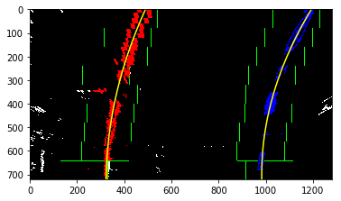

**Advanced Lane Finding Project**

The goals / steps of this project are the following:

* Compute the camera calibration matrix and distortion coefficients given a set of chessboard images.
* Apply a distortion correction to raw images.
* Use color transforms, gradients, etc., to create a thresholded binary image.
* Apply a perspective transform to rectify binary image ("birds-eye view").
* Detect lane pixels and fit to find the lane boundary.
* Determine the curvature of the lane and vehicle position with respect to center.
* Warp the detected lane boundaries back onto the original image.
* Output visual display of the lane boundaries and numerical estimation of lane curvature and vehicle position.


### Camera Calibration

#### 1. Briefly state how you computed the camera matrix and distortion coefficients. Provide an example of a distortion corrected calibration image.

The code for this step is contained in the first code cell of the IPython notebook located in "lane_finding.ipynb"  in the camera calibration step.

The basic mathematic for camera calibration is x = PX, in which x is the pixel point in image coordinate system and X is the object point in the world coordinate system, P is 3x4 matrix with rank 3, and P can be further decomposed into P = K[R|t], and K is the camera intrinsci matrix, R,t are the rotaion and translation matrix with respect to the world coordinate system because image coordinate system and world coordinate system are different. K is the camera matrix we want to find in the below calibration process. For planar patter, [Zhang's method](https://www.microsoft.com/en-us/research/publication/a-flexible-new-technique-for-camera-calibration/) is used to calculate K from a series of images with absolute conic method. This method only applies to planar pattern, so we have to assume z = 0 in world coordinate system.  To minimize the error, we need to have lots of images, preferably 20 images to get good result.

I start by preparing "object points", which will be the (x, y, z) coordinates of the chessboard corners in the world. Here I am assuming the chessboard is fixed on the (x, y) plane at z=0, such that the object points are the same for each calibration image.  Thus, `objp` is just a replicated array of coordinates, and `objpoints` will be appended with a copy of it every time I successfully detect all chessboard corners in a test image.  `imgpoints` will be appended with the (x, y) pixel position of each of the corners in the image plane with each successful chessboard detection.  

I then used the output `objpoints` and `imgpoints` to compute the camera calibration and distortion coefficients using the `cv2.calibrateCamera()` function.  I applied this distortion correction to the test image using the `cv2.undistort()` function and obtained this result: 


It can be seen the curved lines become straight lines.

### Pipeline (single images)

#### 1. Provide an example of a distortion-corrected image.

To demonstrate this step, I will describe how I apply the distortion correction to one of the test images. I used the camera matrix calculated from above and distortion coefficients, then undistort the lane images:

```python
image_f2 = 'test_images/test5.jpg'
image5_o = mpimg.imread(image_f2)
image5 = cv2.undistort(image5_o, mtx, dist)
```


#### 2. Describe how I used color transforms, gradients or other methods to create a thresholded binary image.  Provide an example of a binary image result.

I used a combination of color and gradient thresholds to generate a binary image (Helper functions for perspertive transformation and calculate color, graident thresholded binary images in `lane_finding.ipynb`). I used HLS S channel(saturation channel) to remove shadows, RGB R channel to retain white color and yellow color, gradient x gradient channel to filter out horizontal lines, the threshold values are marked below in the code.

```python
def combined(img):
    s_binary = HLS_select(img, thresh=(200, 250))
    R_binary = RGB_select(img, thresh=(210, 250),channel='R')
    sgbinary = abs_sobel_thresh(img, orient='x', thresh=(20,100))
    combined_binary = np.zeros_like(sgbinary)
    combined_binary[(s_binary == 1) | (sgbinary == 1) | (R_binary==1)] = 1
    return combined_binary
```
 Here's an example of my output for this step.  
  


#### 3. Describe how I performed a perspective transform and provide an example of a transformed image.

The code for my perspective transform includes a function called `warper()`, which appears in file `lane_finding.ipynb`  The `warper()` function takes as inputs an image (`img`), as well as source (`src`) and destination (`dst`) points.  I chose the hardcoded source and destination points in the following manner, these points are selected on the strainght line manually,

```python
src = np.float32(
	[[205,720],
	[1105,720],
	[685,450],
	[595,450]]
)
dst = np.float32(
	[[350,720],
	[950,720],
	[950,0],
	[350,0]]
	)
```

This results in the following source and destination points:

| Source        | Destination   | 
|:-------------:|:-------------:| 
| 205, 720      | 350, 720        | 
| 1105, 720      | 950, 720      |
| 685, 450     | 950, 0      |
| 595, 450      | 350, 0        |

I verified that my perspective transform was working as expected by drawing the `src` and `dst` points onto a test image and its warped counterpart to verify that the lines appear parallel in the warped image.


#### 4. Describe how to identify lane-line pixels and fit their positions with a polynomial?

First, I calculate the histogram of the bottom half of binary curved image as shown above.

```python
histogram = np.sum(binary_warped[binary_warped.shape[0]//2:,:], axis=0)
midpoint = np.int(histogram.shape[0]/2)
leftx_base = np.argmax(histogram[100:midpoint])
rightx_base = np.argmax(histogram[midpoint:-100]) + midpoint
```


I found it has 3 peaks in this histogram due to the noise, so I decided to narrow down the search area from 100 away from the left edge and 100 away from the right edge.


Then I used the sliding window methods to find the center of lines and fit my lane lines with a 2nd order(f(y) = Ay^2 + By + C) polynomial kinda like this for both left lane line curve and right lane line curve:

```python
def sliding_window(binary_warped,nwindows=9, visualize=False):
	......
	histogram = np.sum(binary_warped[binary_warped.shape[0]//2:,:], axis=0)
    midpoint = np.int(histogram.shape[0]/2)
    leftx_base = np.argmax(histogram[100:midpoint])
    rightx_base = np.argmax(histogram[midpoint:-100]) + midpoint
    ....
    for window in range(nwindows):
    	......
    return fit, curvature, f
```


In cases of frame analysis, the line equation from previous frame is already available, so we can use the previous frame line equation to shorten the search time, then I define another function(in lane_finding.ipynb):

```python
def skip_sliding_window(binary_warped, left_fit, right_fit):
	.......
	return fit, curvature, f
```

The details of this two equation is in the "lane_finding.ipynb".

#### 5. Describe how (and identify where in your code) you calculated the radius of curvature of the lane and the position of the vehicle with respect to center.

I used the same method provided from the lecture notes to calculate the curvature, the code is in "lane_finding.ipynb", the basic idea is to transform the lane pixels points from the image to world points through conversion formula: 

```
ym_per_pix = 30/720, #meters per pixel in y dimension
xm_per_pix = 3.7/700,#meters per pixel in x dimension
```
Then, the world points can be fitted with a second order polynomial line equation, the curvature is calculated with the below formula if we know the line equation f(y) = Ay^2 + By + C. And here the y is taken as the closet y point to the camera.


```python
    #calculate the curvature based on the new line equation
def curvature(binary_warped, leftx, rightx, ploty):
    ym_per_pix = 30/720 # meters per pixel in y dimension
    xm_per_pix = 3.7/700 # meters per pixel in x dimension
    left_fit_cr = np.polyfit(ploty*ym_per_pix, leftx*xm_per_pix, 2)
    right_fit_cr = np.polyfit(ploty*ym_per_pix, rightx*xm_per_pix, 2)
#         ploty = np.linspace(0, binary_warped.shape[0]-1, binary_warped.shape[0])
    y_eval = np.max(ploty)
    left_curverad = ((1 + (2*left_fit_cr[0]*y_eval*ym_per_pix + left_fit_cr[1])**2)**1.5) / np.absolute(2*left_fit_cr[0])
    right_curverad = ((1 + (2*right_fit_cr[0]*y_eval*ym_per_pix + right_fit_cr[1])**2)**1.5) / np.absolute(2*right_fit_cr[0])
    return (left_curverad, right_curverad)
```

In the same way, I calculated the offset of camera center from the lane center. I identify the center of the lane lines from the nearest point of the vehicle, then find the difference between image center and lane center, multiplied by the conversion coefficient 3.7/700

```python
#find the offset
center_lane = (right_fitx[-1] + left_fitx[-1])/2
center_image = warped.shape[1]/2
offset = (center_lane-center_image)*3.7/700
```

#### 6. Provide an example image of your result plotted back down onto the road such that the lane area is identified clearly.

After I calculated the line equation of line fittings, I first filled the area bounded by left line and right line in the bird view as shown. Then, I transform the view back into the original image through inverse homograph transformation, and show curvature and offset on the images. 

```python
# Draw the lane onto the warped blank image
cv2.fillPoly(color_warp, np.int_([pts]), (0,255, 0))
# Warp the blank back to original image space using inverse perspective matrix (Minv)
newwarp = cv2.warpPerspective(color_warp, Minv, (image.shape[1], image.shape[0]))
```


---

### Pipeline (video)

#### 1. Provide a link to your final video output.  Your pipeline should perform reasonably well on the entire project video (wobbly lines are ok but no catastrophic failures that would cause the car to drive off the road!).

For the frame analysis, I defined a Line class to track the fitted line coefficients for both left and right lines, and the x coordinate of both left lane lines and right lane lines. In the Line class, I defined the method process_image to process each frame of the vedio. The basis idea for processing is below:

1. For each frame, if no previous lane line equation available, I used sliding window method to find the lane line equation; if previous lane line euqation is available, I used the skip_sliding window method to find lane line equation. These two methods are from the lecture nodes. Also, I keep tracking how many missed lane lines, the missed lane lines means that lane lines detected is unreasable from my sanity check equation.
2. The sanity check equation check the width of the lane through calculating the distance between pixels on the right lane and pixels on the left lane. I compared it with the value from previous saved distance w(I assume these are correct), if it is reasable (difference between this one and the old one is acceptable), then I update w with the new frame lane width through average.
3. If sanity check OK, use the current line equation, push back into the collection defined in the line class. Otherwise, I use the sliding window method again to calculate the new line equation.
4. Smoothing the lines, I simply averaged all the line equations saved in the collection, I think is OK. This is will give me a new line equation for both left lanes and right lanes.
5. I used the new lane line equation to generate new X coordinate for both left lane and right lane
6. I recalculate the curvature with the smoothed line equation and calculate the offset of vehicle from road center by comparin the lane center with image center and show them on the images


Here's a [link to my video result](./output.mp4)


### Discussion

#### 1. Briefly discuss any problems / issues you faced in your implementation of this project.  Where will your pipeline likely fail?  What could you do to make it more robust?

I think there are two difficult parts in this pipeline. 

The first one is image processing with gradient filter or color filter. In this assignment, I used S channel color filtering, R color filtering and x gradient filtering. I am not quite sure if it can capture all the lane lines in all images. Or I need to use more filtering channles and keep tuning the threshold values.

The second issue is how to handle the outliers in the frames. My initial thinking is to use sliding window for the first time, then use the skip_window methods to calculate lines as suggested in the lectures. Then I found the pipeline behaviors not very smoothly in certain frame, though I used averaged line coefficients methods. Here, I saved the coefficients of previous 10 good frames. Then, in the sanity check, I checked if the distance between right lane lines and left lane lines is smaller than the threshold. After I detected bad lines, I used the most recent line equation as current line equation and use the smoothed line equation as current line equation. However, it does not imporve too much. So I decided to use sliding window again if the sanity check fails, slightly better but not up to expectation. But I think it is acceptable for the project video. I will keep trying on the other vedios.