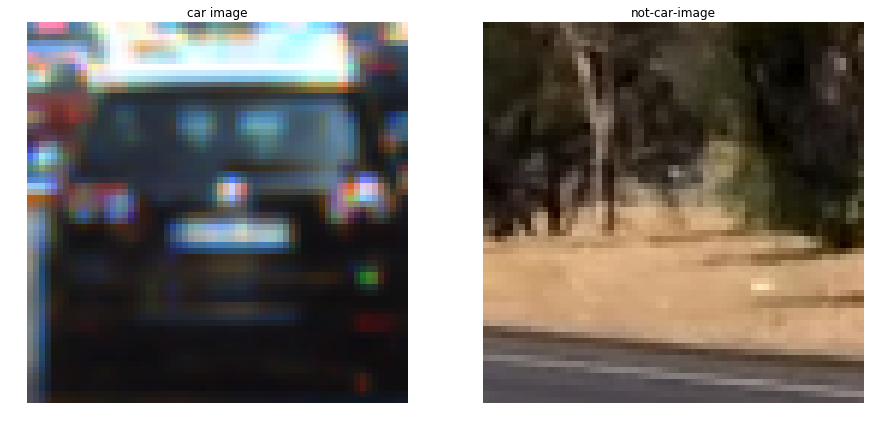
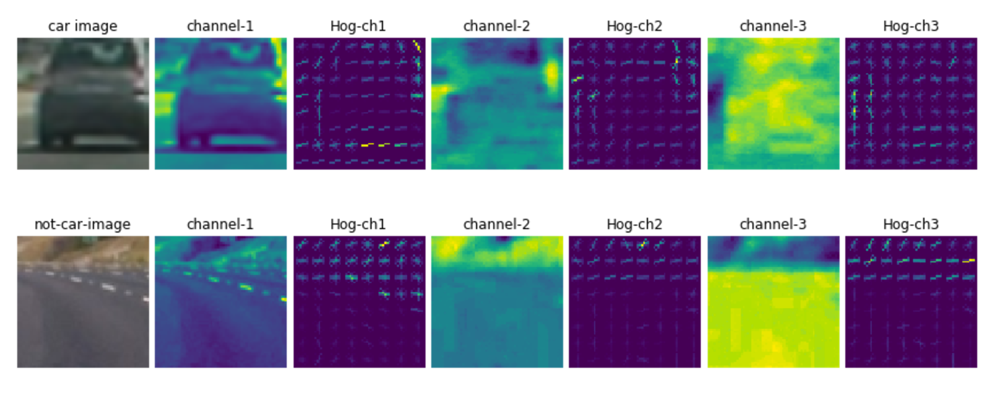
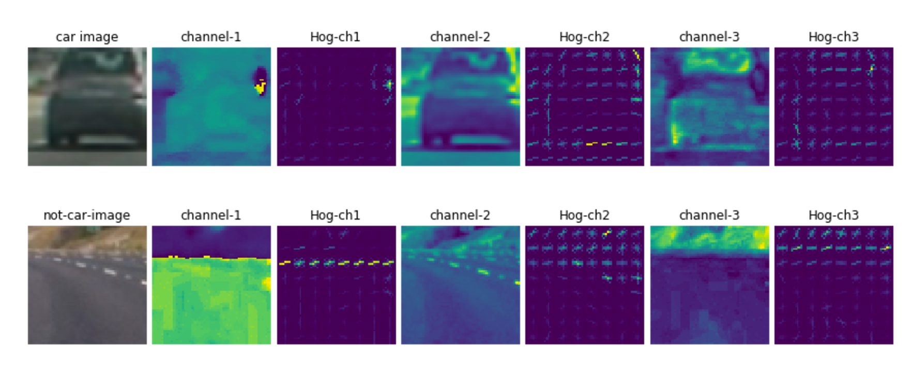
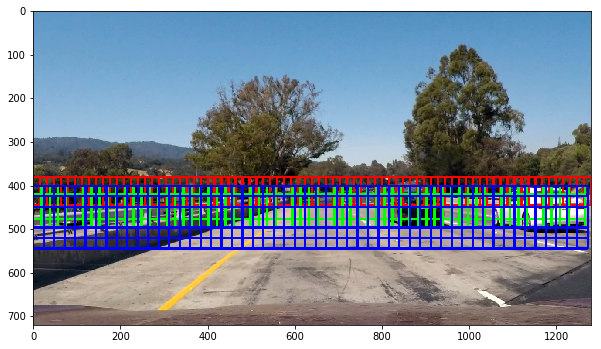
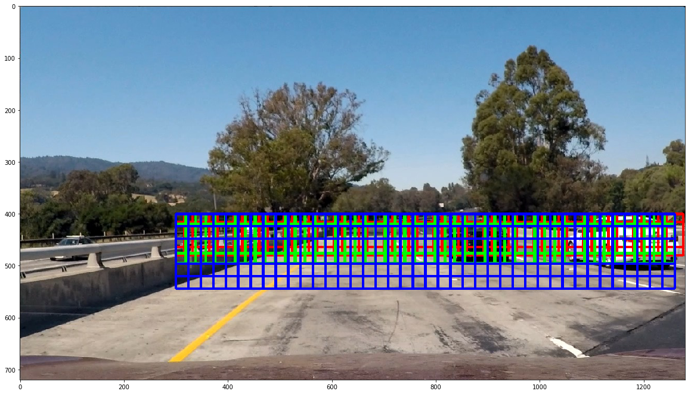
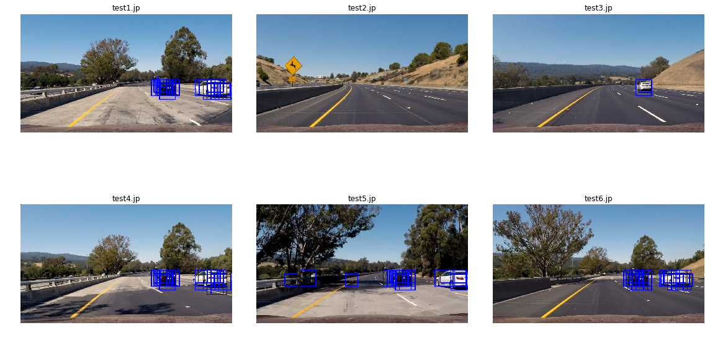
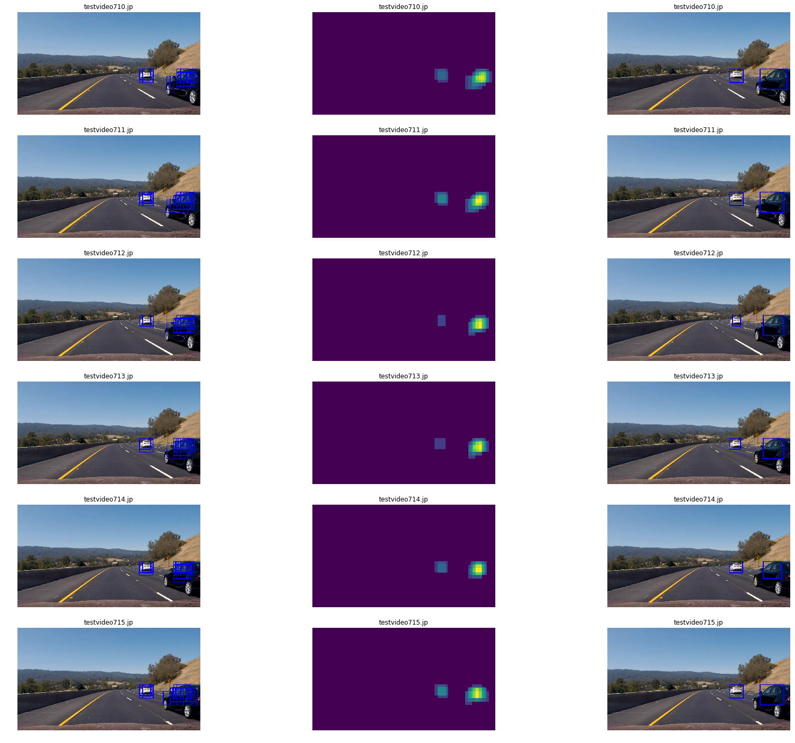
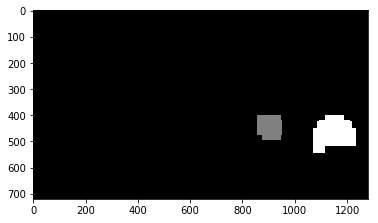
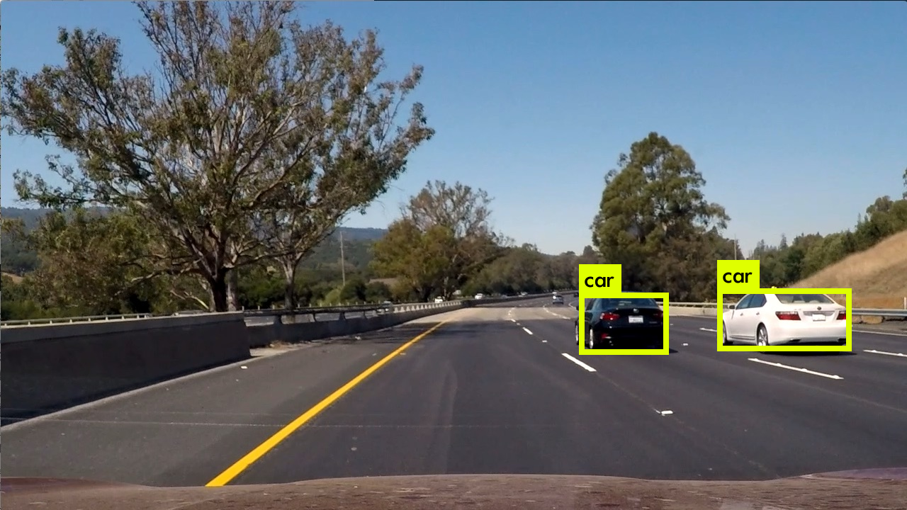

**Vehicle Detection Project**

The goals / steps of this project are the following:

* Perform a Histogram of Oriented Gradients (HOG) feature extraction on a labeled training set of images and train a classifier Linear SVM classifier
* Optionally, you can also apply a color transform and append binned color features, as well as histograms of color, to your HOG feature vector. 
* Note: for those first two steps don't forget to normalize your features and randomize a selection for training and testing.
* Implement a sliding-window technique and use your trained classifier to search for vehicles in images.
* Run your pipeline on a video stream (start with the test_video.mp4 and later implement on full project_video.mp4) and create a heat map of recurring detections frame by frame to reject outliers and follow detected vehicles.
* Estimate a bounding box for vehicles detected.

The files submitted is listed below: 
 
* lession.py   -- all support subroutine from lecture notes
* Training.ipynb  -- code for training SVM
* find_car.ipynb  -- code for sliding window and predictions

### Data Exploration
In these project, the training images come from a combination of the GTI vehicle image database and the KITTI vision benchmark suite, and the predictions are from images extracted from the project video itself. In the training examples, there are a total of 17760 car images and 8460 non-car images, so there are more car images than non-car images. 
 
### Histogram of Oriented Gradients (HOG)

#### 1. Explain how (and identify where in your code) you extracted HOG features from the training images.

The code for this step is contained in the second code cell of the IPython notebook `find_car.ipynb` and the `got_hog_features` funciton is from the `lession.py` for the functions from the course.

```python
for channel in range(img.shape[2]):
    feature,image = get_hog_features(img[:,:,channel], orient, pix_per_cell, cell_per_block, 
                        vis=True, feature_vec=True)
```

I started by reading in all the `vehicle` and `non-vehicle` images.  Here is an example of one of each of the `vehicle` and `non-vehicle` classes:



I then explored different color spaces and different `skimage.hog()` parameters (`orientations`, `pixels_per_cell`, and `cells_per_block`).  I grabbed random images from each of the two classes and displayed them to get a feel for what the `skimage.hog()` output looks like.

Here is an example using the `YCrCb` color space and HOG parameters of `orientations=9`, `pixels_per_cell=(8, 8)` and `cells_per_block=(2, 2)`, `spatial_size = (16, 16)`, `hist_bins` = 32  



#### 2. Explain how you settled on your final choice of HOG parameters.

I tried various combinations of parameters. Firstly, I checked the color space HLS and YCrCb. RGB color space is discarded because it does not give good performance with varied lightness condition as discussed in the Lane finding project. Here, we are going to compare the visual features of YCrCb color space and HLS colorspace. As it can be seen, the hog features in  YCrCb is more obvious than the hog features in HLS color space.  So I choose the YCrCb color space.

Below is the sample HOG feature output from HLS color space.


As for the different skimage.hog() parameters (orientations, pixels\_per\_cell, and cells\_per\_block). I choose the same parameter used in the lecture notes because it gives good performance. The only difference is that I have reduced the size of spatial_size because it is not the dominant feature in comparason with HOG features.

```
orientations:  9
pixs_per_cell:  8
cells_per_block:  2
spatial_size:  (16 16)
hist_bins:  32
```

#### 3. Describe how (and identify where in your code) you trained a classifier using your selected HOG features (and color features if you used them).

I trained a linear SVM using features consisting of all channels of images from YCrCb color space and HOG feature vector and the details are int the `Training.ipynb` file. In order to have better accuracy, all three channesl are used and the feature vector has a length of 6156 and most of which are HOG features. Since the dominant feature in this feature vector is the HOG feature, so I decided to use smaller spatial_size:  (16 16) for color spaces. 

Here, the images used for training SVM is all PNG images and the feature vectors are standardized to ensure all numerical values are within the range [-1,1].

```
X_scaler = StandardScaler().fit(X)
# Apply the scaler to X
scaled_X = X_scaler.transform(X)
```

The training examples are firtly randomly shuffled, and then split into training and testing portions with percentage 20%.

```
X_train, X_test, y_train, y_test = train_test_split(
    scaled_X, y, test_size=0.2, random_state=rand_state)
``` 

With the above configurations, the trainings is done with below results.

```
X Shape: (17760, 6156)
Using: 9 orientations 8 pixels per cell and 2 cells per block
Feature vector length: 6156
48.48 Seconds to train SVC...
Test Accuracy of SVC =  0.9893
```
Handling the PNG and JPG files, the training files I used is all PNG files and the picture files has already been normalized, but the detection image is JPG files and the pixel values are from 0 - 255, so I have to nomalize it manually in the code.

`img = img.astype(np.float32)/255`

After finishing the training, I save the training configurations into the pickle file to make sure the parameters are consistent with each other in the latter prediction for new images.

```
svc_data = {}
svc_data["svc"] = svc
svc_data["scaler"] = X_scaler
svc_data["orient"] = orient
svc_data["pix_per_cell"] = pix_per_cell
svc_data["cell_per_block"] = cell_per_block
svc_data["spatial_size"] = spatial_size
svc_data["hist_bins"] = hist_bins
pickle.dump(svc_data,open("svc_pickle.p", "wb" ))
```

### Sliding Window Search

#### 1. Describe how (and identify where in your code) you implemented a sliding window search.  How did you decide what scales to search and how much to overlap windows?

I decided to use a search window with size (64,64) because this is size is the original training sample image size. I used the search window methods to search window from left to right, up to down, then I realized that the cars in the image only concentrate in some specified area, so I decided to narrow down the search areas. Here, I choose the search area in the y direction from 400 to 600 and in the x direction starting from 300. 

In the implementation, I used the Hog Sub-sampling Window Search methods because it is more efficient that allows us to only have to extract the Hog features once. The code for a single function find_cars that's able to both extract features and make predictions is defined in cell 3 in `find_car.ipynb` file.  

In this function, scale of object is considered and I used scale factors 1, 1.2, 1.5. The scale factor here is to control the search window size, so a large scale can capture large object in the image. I tested different scale factors like 2, 3 and found it does not give better prediction, so I decided to use a scale factor 1.5, so the search window size is within the range of 64, 77, 1.5*64 = 96. In the same time, the overlapping percentage is controlled with 0.75 through setting pixels per step 2 between scaled two windows to ensure all the objects in the window can be found.  Here below is the the example images with marked with grid for the search area:




In the first image I considered the entire x dimension in the images and only include a limited x area in the second image. As it can be seen, the narrowed search area covers all the cars.


#### 2. Show some examples of test images to demonstrate how your pipeline is working.  What did you do to optimize the performance of your classifier?

Ultimately I searched on three scales using YCrCb 3-channel HOG features plus spatially binned color and histograms of color in the feature vector, which provided a nice result.  Here are some example images:



In each image, the program running times is 

```
0.69 Seconds to find cars...
0.61 Seconds to find cars...
0.58 Seconds to find cars...
0.57 Seconds to find cars...
0.6 Seconds to find cars...
0.69 Seconds to find cars...
```
It is not very fast but gives pretty good detection in the vehicle areas.

---

### Video Implementation

#### 1. Provide a link to your final video output.  Your pipeline should perform reasonably well on the entire project video (somewhat wobbly or unstable bounding boxes are ok as long as you are identifying the vehicles most of the time with minimal false positives.)
Here's a [link to my video result](./output.mp4)


#### 2. Describe how (and identify where in your code) you implemented some kind of filter for false positives and some method for combining overlapping bounding boxes.

I recorded the positions of positive detections in each frame of the video.  From the positive detections I created a heatmap and then thresholded that map to identify vehicle positions.  I then used `scipy.ndimage.measurements.label()` to identify individual blobs in the heatmap.  I then assumed each blob corresponded to a vehicle.  I constructed bounding boxes to cover the area of each blob detected.  

Here's an example result showing the heatmap from a series of frames of video, the result of `scipy.ndimage.measurements.label()` and the bounding boxes then overlaid on the last frame of video:

### Here are six frames and their corresponding heatmaps:



### Here is the output of `scipy.ndimage.measurements.label()` on the integrated heatmap for the sixth test image:


### Here the resulting bounding boxes are drawn onto the last frame in the series:


#### 3. How to remove jittering in the consecutive images? 
I used a global queue variable **allsaved** with size **nframe** to save the previous hot windows up to **nframe** ,and added all the values in these hot windows as the hot window for the current frame, and then apply threshold function with threshold value equal to the value of nframe. If new frame comes and the queue is already full, so the first element of the queue will be poped out and replaced by the most recent hot window, and the sum of values of all hot windows needs to be recalculated again. In this way, the transition between detected boxes is much more smoother than the one with no window filtering technique. Besides that, I choose to process every other images in the video to speed up the processing time.

### 4. Yolo comparison

It would be interesting to compare this model with the existing deep learning based detection framework Yolo.[This](https://medium.com/@xslittlegrass/almost-real-time-vehicle-detection-using-yolo-da0f016b43de) has very good introduction on how to build a tiny Yolo model and use the already-trained yolo model parameters to predict objects on the images. A complete explanation on the Yolo model is avaiable in the [web](https://pjreddie.com/darknet/yolo/). Below is an example of image detection by Yolo.


Here's a [link to Yolo video](./out_yolo.mp4)


---
### Discussion

#### 1. Briefly discuss any problems / issues you faced in your implementation of this project.  Where will your pipeline likely fail?  What could you do to make it more robust?

In my approach, for each scale, I used the `find_car` method to calculate the hog feature first and then sub-sample the regions to get the hog features for all over-lapped areas. The drawback for this approach is I have to calculate the hog feature for entire search region in each scale. In my case, I used 3 different scales, so I have to calculate the 3 times for the hog features in the entire search region. This slows down the calculation time. 

Besides that the detected vehicle shape between frames is not quite stable, so I am thinking it might can be improved if I use the combination of the previous frames to get the shape of vehicle in the current frame.