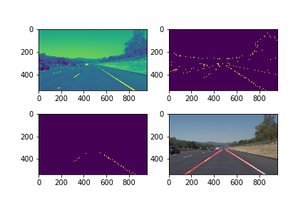
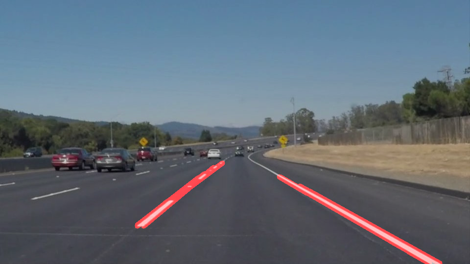
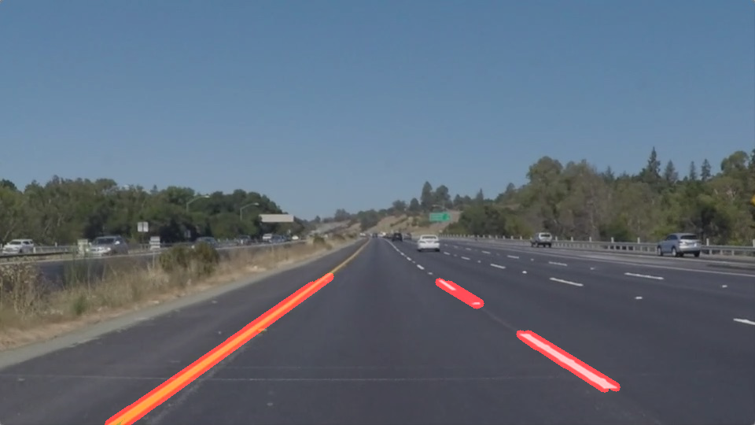
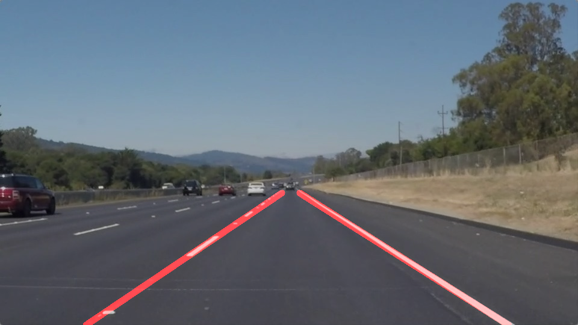

#**Finding Lane Lines on the Road** 

**Finding Lane Lines on the Road**

The goals / steps of this project are the following:

* Make a pipeline that finds lane lines on the road
* Reflect on your work in a written report

### Reflection

###Piplines 

--

1. Read an image and convert it to grayscale as we did in the lecture following the standard procedures in helper functions

2. Apply gaussian blur with kernel size = 3, canny edge detection, select region of interest in form of triangle area, and apply hough line transformation with parameter **threshhold = 25, minlength = 50, maxlength = 120**. As for the hough line transformation, I have to keep trying different parameters, it is very time consuming. For instance, the below images are produced according to the code and it can be seen that not all segement are the real line segment
	
	
	
	
	

3. Once all the line segements have been retrieved in the previous stage, then we can segreate the lines into left and right section according to the slope of the line. 

4. In order to draw lines for the lane instead of line segment, I have to average and/or extrapolate the line segments, the way I did it is, for lines in the left group or the right group, and save all the line segments in the left and right group respectively. Also I use the slope value 0.5 to filter out the horizontal line segments, these are outliers.

5. In the left list and right list, remove apparent outliers. First, calculate the average slopes and standard deviation, if the average one is out of the 1.0 standard deviation, then I can remove it.

6. For those line segments selected from step 5, I can get the averaged line equation (1,b/a,c/a) as the final line equation for left lanes and right lanes,
 I can find the intersection points and draw left lane from the image bottom to the intersection point. Here I hardcoded some y distance so the left lane and right lane does not end up in the interesection points because sometimes, it does not make too much sense to end in the intersection points.

	

7. A tricky part is if the intersection points is at infinity. All the images provided has significant projective distoration on the image which means the parallel lines no longer parallel in the image, so they do intersect.

8. The other difficult part is how to determin the outliers for the many line segments, it does occur when many line segment are outliers.

9. The i tried to work on the challenge part, but it does not work very well on that part.

### Identify any shortcomings
A disadvantage of this method is hard tuning of parameters in Hough line transformation, I have to keep changing the parameters. Also, it is difficult to determin the region of interest exactly so as to exclude the background line segement. Then, I can still find lots of outliers in the line segment, they are just background line segment. As for the videos, I can not make 100% coverage of left lane and right lanes and there are deviations sometime especially when curvature occurs and lines become very thin.

As for the challenge part, I think I have generated too many unnecessary lines in the hough line seletions part, and my code does not seem work very well to determine which are the lane lines and which are the not. That's why it gets some weird lines on the output in the challenge video. However, in some part of the challenge video, if the background noise is less, the results are better.

### Suggest possible improvements
It would be nice if we can easily determine the parameters of Hough line transform and decide an effective way to remove line segment outliers. Sometimes, there are many outliers when backgroud is mixed with trees, vehicles and others.