# **Traffic Sign Recognition** 

---

### Data Set Summary & Exploration

#### 1. Provide a basic summary of the data set. In the code, the analysis should be done using python, numpy and/or pandas methods rather than hardcoding results manually.

I used the pandas library to calculate summary statistics of the traffic
signs data set:

* The size of training set is  **34799**
* The size of the validation set is **4410**
* The size of test set is **12630**
* The shape of a traffic sign image is **32x32x3**
* The number of unique classes/labels in the data set is **43**

#### 2. Include an exploratory visualization of the dataset.

Here is an exploratory visualization of the data set. It is a bar chart showing how the data many sign board for each category

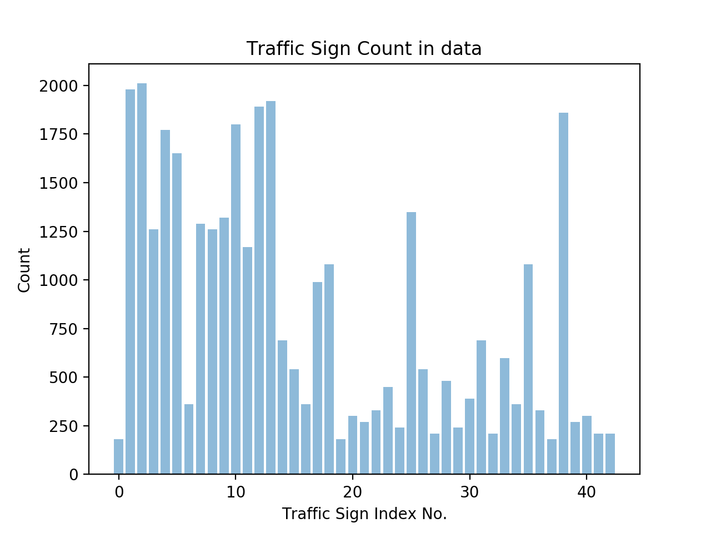

And all the unique labels in the data is in below figure.

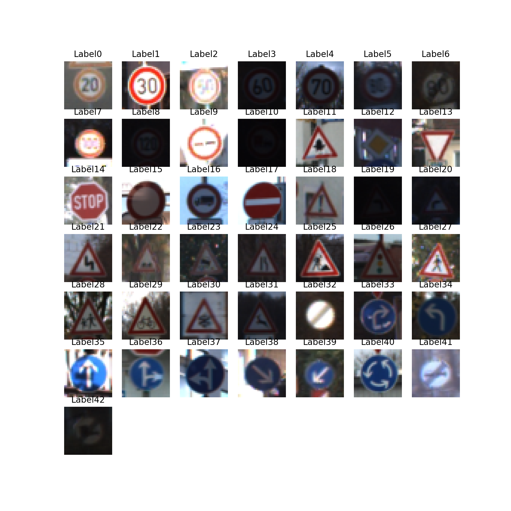

### Design and Test a Model Architecture

#### 1. Describe how you preprocessed the image data. What techniques were chosen and why did you choose these techniques? Consider including images showing the output of each preprocessing technique. Pre-processing refers to techniques such as converting to grayscale, normalization, etc. (OPTIONAL: As described in the "Stand Out Suggestions" part of the rubric, if you generated additional data for training, describe why you decided to generate additional data, how you generated the data, and provide example images of the additional data. Then describe the characteristics of the augmented training set like number of images in the set, number of images for each class, etc.)

As a first step, I decided to convert the images to grayscale because the color image does not help to process classifiy the different traffic signs, and gray scale can significantly reduce the large amount of computation time because the channel is only 1 for grayscale. 

Here is an example of a traffic sign image before and after grayscaling, and the way I gray scale the image is to average the 3 channels into one single channel.

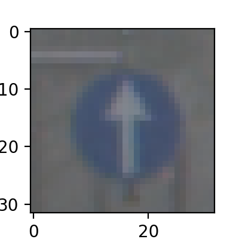
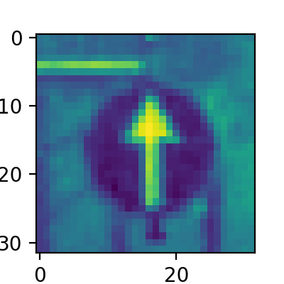


As a last step, I normalized the image data because the demensionality of input should be consistent with each other. Normalization will ensure the input data is within (-1,1) to give better model prediction.

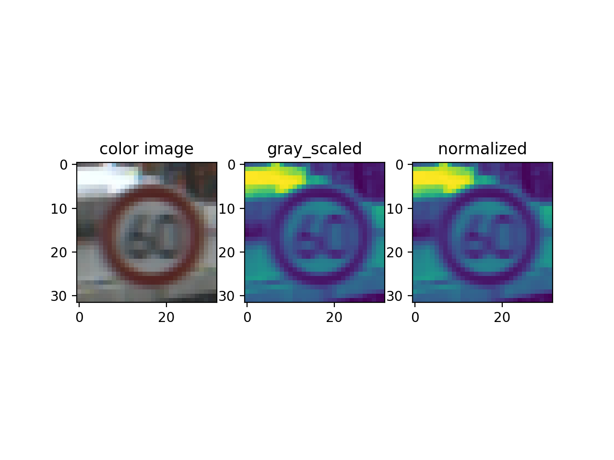

Then, I decided to generate additional data set because the sign board types does not have equal distribution, some sign board have significantly less samples compared with others. Then I decide to bring these ones to reach at least the average , so I calculated the average of sign boards for these 43 types of sign board, then generate data accordingly through rotation and translation.

To add more data to the the data set, I used the following techniques: rotation image around the center of image with small random angle, translate the image left/right, up/down randomly with small displacement, shear the image as introduced in the [article](https://medium.com/@vivek.yadav/dealing-with-unbalanced-data-generating-additional-data-by-jittering-the-original-image-7497fe2119c3)

Here is an example of an original image and an augmented image:

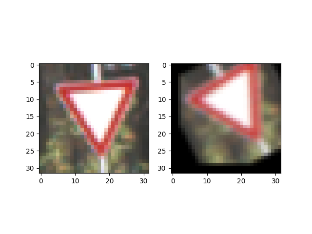

The difference between the original data set and the augmented data set is the following: the augmented data is  rotated and translated in some small displacement.

Overally, the distribution for the newly augmented data is:

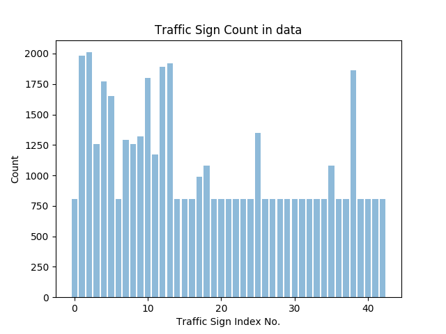

#### 2. Describe what your final model architecture looks like including model type, layers, layer sizes, connectivity, etc.) Consider including a diagram and/or table describing the final model.

In this project, I used the LeNet as the starting point for this archetecture, and then I changed some of the parts, such as filter size, layer size etc.

My final model consisted of the following layers:

| Layer         		|     Description	        					| 
|:---------------------:|:---------------------------------------------:| 
| Input         		| 32x32x1 RGB image   							| 
| Convolution 5x5     	| 1x1 stride, valid padding, outputs 28x28x30 	|
| RELU					|						
| Max pooling	      	| 2x2 stride,  outputs 14x14x30 				|
| Convolution 5x5	    | 1x1 stride, valid padding, outputs 10x10x16  
| RELU					|						
| Max pooling	      	| 2x2 stride,  outputs 5x5x30     									|
| Fully connected		| output 200        									|
| Fully connected		| output 100       									|
| Fully connected		| output 43     									|
| Softmax				| output 43        									|
 
Also it can be visualize with tensor board to have better understanding on the archetecture 
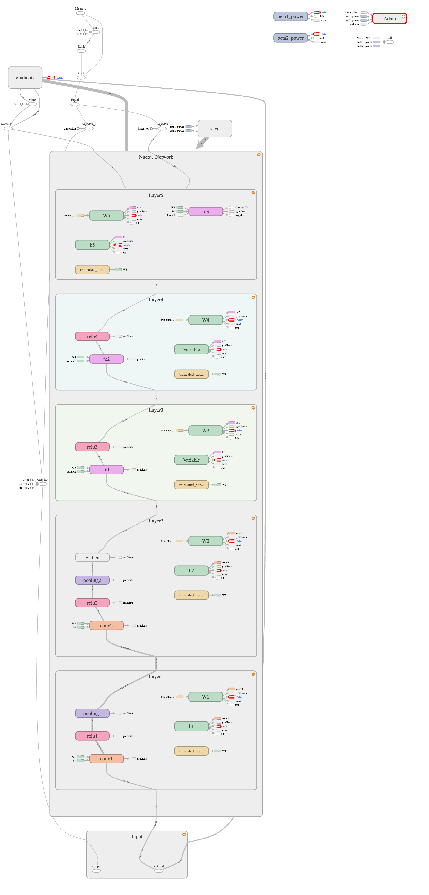

#### 3. Describe how you trained your model. The discussion can include the type of optimizer, the batch size, number of epochs and any hyperparameters such as learning rate.

To train the model, I used Amazon Web Serivce to provide GPU support for calculation, I do not have GPU support on my computer, then I used the iterative process with the AdamOptimizer, learning rate 0.002, epoches 300, batch size 256. Here, I use the epoches 300 as the maximum running epoches, it means the actual running time is less thatn the 300 epoches, and I keep checking the validation accuracy and stop the iteration once the validation accuracy exceeds 0.95 which I consider as good accuracy.

#### 4. Describe the approach taken for finding a solution and getting the validation set accuracy to be at least 0.93. Include in the discussion the results on the training, validation and test sets and where in the code these were calculated. Your approach may have been an iterative process, in which case, outline the steps you took to get to the final solution and why you chose those steps. Perhaps your solution involved an already well known implementation or architecture. In this case, discuss why you think the architecture is suitable for the current problem.

My final model results were:

* training set accuracy of 0.997
* validation set accuracy of 0.953
* test set accuracy of 0.929

If an iterative approach was chosen:

* What was the first architecture that was tried and why was it chosen?<br> I choose the LeNet as the starting point because it is well known and already gives good accuracy in prediction of handwriting letters. So it can be easily established and then I can gradually change the parameters to check the accuracy.

* What were some problems with the initial architecture?<br>
The problem for the initial archetecture is that accuracy is too low and accuracy does not improve a lot after many epoches. So I have to find some ways to improve the accuracy. I check the forum and found some students experience the same issue, so I can either make the model more complex or make it simpler, then I decided to use a rather complex model, then I increased the number of hdden neurons.

* How was the architecture adjusted and why was it adjusted? <br>Typical adjustments could include choosing a different model architecture, I did not add additional layer or taken out layers because I am not sure it is going to make better performance or not. Instead I added more neurons for each layers and hope to achive better performance. As for the dropout or changing activation, I did not take this option either because this will make the model much more complex. My thoughts on this is that I have to find some good data, because if data is not good, then the model can't give very good performance. Another problem is that the model tends to be overfitting if there are too many data. In my case, I have added 10000 more data to the original data through rotation/translation of original images. I suspect it has some overfitting because the traning accuracy is 0.995 but validation accuracy is only 0.953, the validation accuracy can be higher than this with 0.995 traning accuracy. 


* Which parameters were tuned? How were they adjusted and why?<br>
I changed the convolution filter sizes in comparason with the oringinal one. In the original LeNet, the first convolution layer has 6 hidden units, I increase it to 30 hidden units because I think this will keep more information with 30 hidden units. In the fully connected layer, I did the same and increased the hidden units connected. The accuracy improves a little bit.

* What are some of the important design choices and why were they chosen? For example, why might a convolution layer work well with this problem? How might a dropout layer help with creating a successful model?<br> The dropout layer might work well but I did not test it. The convolution layer works well to improve the validation accuracy to more than 0.93. But I am not sure if the dropout layer will make it better.

If a well known architecture was chosen:
I choose the LeNet with 2 convolutional layer, 2 fully connected layer and 2 max pooling layer.  It is relevant to the traffic sign application because it did well with gray-scale hidden written images.   
 

### Test a Model on New Images

#### 1. Choose five German traffic signs found on the web and provide them in the report. For each image, discuss what quality or qualities might be difficult to classify.

Here are five German traffic signs that I found on the web:

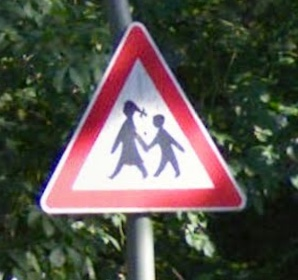  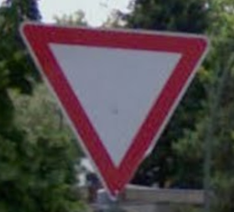 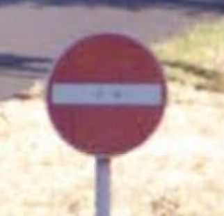 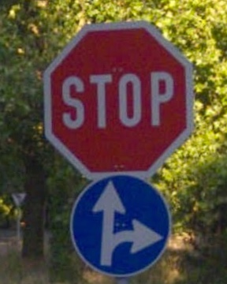

The first and second image might be difficult to classify because it has text and a bycyle in the image while in the training image set, it does not have these noise information. The same is true for the fifth image, so I guess these images are the most difficult to train.

#### 2. Discuss the model's predictions on these new traffic signs and compare the results to predicting on the test set. At a minimum, discuss what the predictions were below, the accuracy on these new predictions, and compare the accuracy to the accuracy on the test set (OPTIONAL: Discuss the results in more detail as described in the "Stand Out Suggestions" part of the rubric).

Here are the results of the prediction:

| Image			        |     Prediction	        					| 
|:---------------------:|:---------------------------------------------:| 
| Children Crossing      		| Narrowed Road Ahead 									| 
| Priority Road   			| Priority Road 										|
| Yield					| Yield											|
| No-entry	      		| Yield				 				|
| Stop			|  Priority Road      							|


The model only guesses 2 of the 5 traffic signs, which gives an accuracy of 40% in comparason to test accuracy 92.9%.

#### 3. Describe how certain the model is when predicting on each of the five new images by looking at the softmax probabilities for each prediction. Provide the top 5 softmax probabilities for each image along with the sign type of each probability. (OPTIONAL: as described in the "Stand Out Suggestions" part of the rubric, visualizations can also be provided such as bar charts)

The code for making predictions on my final model is located in the 11th cell of the Ipython notebook.

For the first image, the model is confidently sure that this is a 'Road narrows on the right' sign (probability of 0.999), and the image does not contain a 'Road narrows on the right'. The top five soft max probabilities is listed in below table, the possible explantion is that the two sign board shape is the same - triangle shape, and label 28 has two black lines representing the road and label 24-'children crossing' has two black human shape line. So these two are very close to each other.

| Probability         	|     Prediction	        					| 
|:---------------------:|:---------------------------------------------:| 
| 1.0         			| Road narrows on the right									| 
| .0     				| Dangerous cruve to the left 										|
| .0					| Bicycles crossing											|
| .0	      			| Traffic Signals					 				|
| .0				    | Pedestrians     							|

The top five soft max probabilities distribution is 

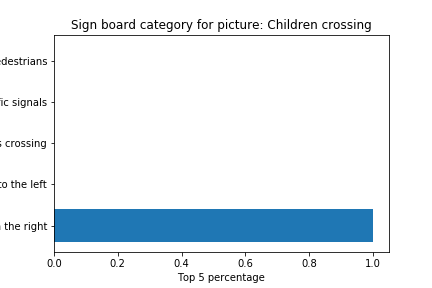

For the second image,  it gives high confidence it is a sign board for priority road, and it is actually a sign for priority road.
The top five soft max probabilities were

| Probability         	|     Prediction	        					| 
|:---------------------:|:---------------------------------------------:| 
| .999         			| Priority Road   									| 
| .000005     				| Roundabout mandatory								|
| .0					| Go straight or right											|
| .0	      			| Speed limit 20					 				|
| .0				    | Speed limit 30	    							|

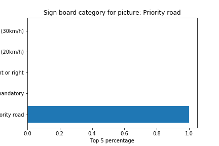

For image 3, it gives high confidence with 0.999 that it is a sign board for yield and it actually is a yield. The top five soft max probabilities were

| Probability         	|     Prediction	        					| 
|:---------------------:|:---------------------------------------------:| 
| .9985         			| yield   									| 
| .0001     				| Keep left 										|
| .0					| Slippery Road											|
| .0	      			| Stop				 				|
| .0				    | Speed limit(80km/h)  

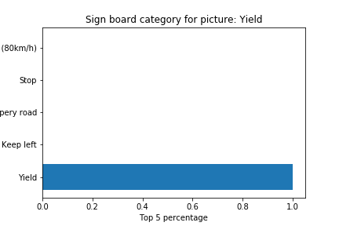

For image 4, it predicts the sign board is yield with probability 0.66. But actually it is a stop sign board. The possible explanation for this mis-classification is that the image is blured or distorted and the model indeed confuses with certainty only 0.66. The top five soft max probabilities were

| Probability         	|     Prediction	        					| 
|:---------------------:|:---------------------------------------------:| 
| .66        			| Yield   									| 
| .33     				| Stop 										|
| .001					| 	End of no passing by vehicles over 3.5 metric tons								|
| .0	      			| Turn left ahead				 				|
| .0				    | Keep left  

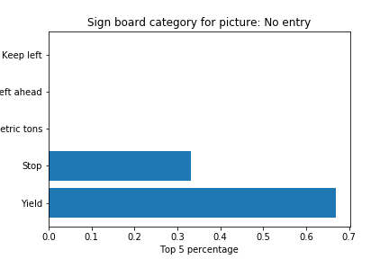

For image 5, it predicts that the sign board is priority road with probability 0.999. But it is actually a Stop sign board. The possible explanation is that the image is mixed with other sign board, such as left arrow, so it gives misjudgement. The top five soft max probabilities were

| Probability         	|     Prediction	        					| 
|:---------------------:|:---------------------------------------------:| 
| .95        			| Priority road   									| 
| .03     				| Roundabout mandatory										|
| .006					| 	Go straight or right									|
| .0.0004	      			| Stop				 				|
| .00005				    | Road work

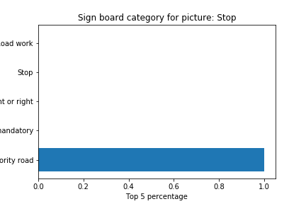

In summary, this model can't give good predictions for any image I found from the web, even though these images might be obvious to human being. It highly depends on the way how images/pictures are generated, cropped, rotated, translated, blurred, nosie information. So images has to be processed first, such as removal of noise and skewness, then it can give better predictions.

There are many more advanced model which are trained with much better macines available, so a better idea would use the existing trained model and only slight change the last few layers if the type of training are similar. Here, a good idea is to use AlexNet since the number of parameters in the model is still accpetable.

The last layer of alex-net is connected to more than 1000 classes, but here, we only have 43 classes, thus we can redefine the last fully connected layer with 43 classes. So we only need to train the last layer while keeping the rest of the layers unchanged. The alex-net archeture is defined in the ```alexnet.py``` file and the training images/parameters are loaded from the saved [files](https://drive.google.com/drive/u/0/folders/0B4ORAVKduZjINDlMLTFOc2ZFQWM).

```python
nb_classes = 43
epochs = 10
batch_size = 128

with open('./train.p', 'rb') as f:
    data = pickle.load(f)

X_train, X_val, y_train, y_val = train_test_split(data['features'], data['labels'], test_size=0.33, random_state=0)

features = tf.placeholder(tf.float32, (None, 32, 32, 3))
labels = tf.placeholder(tf.int64, None)
resized = tf.image.resize_images(features, (227, 227))

# Returns the second final layer of the AlexNet model,
# this allows us to redo the last layer for the traffic signs
# model.
fc7 = AlexNet(resized, feature_extract=True)
fc7 = tf.stop_gradient(fc7)
shape = (fc7.get_shape().as_list()[-1], nb_classes)
fc8W = tf.Variable(tf.truncated_normal(shape, stddev=1e-2))
fc8b = tf.Variable(tf.zeros(nb_classes))
logits = tf.nn.xw_plus_b(fc7, fc8W, fc8b)
``` 

The above models are trained in the python file ```Traffic_Sign_Classifier_Alex.ipynb```. The training results is listed below:

```
Epoch 9
Time: 95.445 seconds
Validation Loss = 0.148924623241
Validation Accuracy = 0.960989201995

Epoch 10
Time: 95.428 seconds
Validation Loss = 0.134092179157
Validation Accuracy = 0.964994775402
```
The above traning gives good prediction validation accuracy with only 10 epoches.

